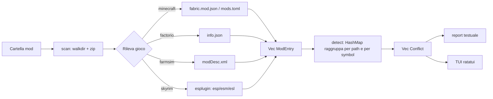

# ModConflict — Piano di implementazione

**Obiettivo**: CLI/TUI in Rust che scansiona una cartella di mod (Minecraft, Skyrim, Factorio, Farming Simulator) e segnala i conflitti — file sovrascritti, ID duplicati, dipendenze rotte — *prima* che il gioco crashi.

**Obiettivo secondario (esplicito)**: imparare Rust + ratatui. Le fasi sono ordinate anche per curva didattica, non solo per valore funzionale.

---

## 1. Scope

### Dentro (MVP)
- Scansione ricorsiva di una cartella mod, sia file sciolti che archivi `.zip`/`.jar`.
- Rilevamento **collisione di path**: due mod forniscono lo stesso file interno.
- Rilevamento **ID duplicati** (mod id / prototype name / FormID).
- Rilevamento **dipendenze mancanti o versione incompatibile** (dove il formato le dichiara).
- Report testuale + TUI navigabile.

### Fuori (per ora)
- Risoluzione automatica dei conflitti / patching.
- Load order optimization (è quello che fa LOOT, non riscriviamolo).
- GUI grafica, integrazione con mod manager (Vortex/MO2/CurseForge).
- Download o installazione di mod.

---

## 2. Il modello di dati (il cuore)

Tutti e quattro i giochi si riducono alla stessa forma. Un mod è:

```rust
struct ModEntry {
    id: String,              // mod id dichiarato, o nome file come fallback
    version: Option<String>,
    source: PathBuf,         // archivio o cartella
    files: Vec<String>,      // path interni normalizzati
    provides: Vec<Symbol>,   // ID che il mod "possiede"
    requires: Vec<Dep>,      // dipendenze dichiarate
}
```

Un conflitto è:

```rust
enum Conflict {
    FileOverlap { path: String, mods: Vec<ModId> },
    DuplicateId { symbol: Symbol, mods: Vec<ModId> },
    MissingDep  { mod_id: ModId, dep: Dep },
    VersionMismatch { mod_id: ModId, dep: Dep, found: String },
}
```

Il parser specifico per gioco riempie `ModEntry`. Il detector lavora **solo** sul modello generico: aggiungere un quinto gioco = un file nuovo, zero modifiche al detector.



---

## 3. Cosa cerchiamo, per gioco

| Gioco | Sorgente metadati | Conflitto tipico |
|-------|-------------------|------------------|
| **Minecraft** | `fabric.mod.json`, `META-INF/mods.toml` dentro il `.jar` | stesso `assets/`/`data/` path in due jar; stesso mod id; `depends` non soddisfatto |
| **Factorio** | `info.json` dentro lo zip | stesso nome prototype; `dependencies` mancanti; incompatibilità `!` dichiarate |
| **Farming Sim** | `modDesc.xml` dentro lo zip | stesso nome mod; stesso path script/i3d; `l10n` doppie |
| **Skyrim** | header record TES4 via crate `esplugin` | stesso FormID toccato da più plugin; master mancante; loose file in `Data/` che sovrascrive un BSA |

**Riuso, non riscrittura**: `esplugin` è la libreria che sta dietro a LOOT — non scriviamo un parser binario TES da zero. Se non copre un caso, si estende dopo.

### Dipendenze (crates)
`clap`, `walkdir`, `zip`, `serde` + `serde_json`, `toml`, `roxmltree`, `esplugin`, `anyhow`, `ratatui`, `crossterm`.

---

## 4. Fasi

### Fase 0 — Setup (prerequisito, ~15 min)
`cargo` **non è installato** su questa macchina. Va fatto prima di tutto:

```bash
winget install Rustlang.Rustup
```

Poi `cargo new modconflict` + dipendenze base.

**Impari**: struttura di un crate, `Cargo.toml`, `cargo run` / `test` / `clippy`.

### Fase 1 — Scansione (nessuna TUI)
`scan.rs`: cammina la cartella, apre gli zip/jar, produce l'elenco dei path interni. Output: stampa a schermo, niente altro.

**Impari**: ownership e borrowing su `Vec`/`String`, `Result` + operatore `?`, `anyhow` per gli errori, iteratori.

**Check**: un test con una cartella fixture (2 zip finti costruiti nel test) che verifica il conteggio dei file.

### Fase 2 — Detector
`conflict.rs`: raggruppa con `HashMap<String, Vec<ModId>>`, emette `Conflict` dove il gruppo ha >1 elemento. Severità: `Critical` (ID duplicato, dep mancante) / `Warning` (file overlap) / `Info`.

**Impari**: `HashMap`, entry API, pattern matching su enum, `derive`.

**Check**: test unitari sul detector — input `Vec<ModEntry>` costruito a mano, nessun I/O.

### Fase 3 — Parser per gioco
`games/{minecraft,factorio,farmsim,skyrim}.rs`, dispatch con `enum Game` + `match` (niente trait finché non serve davvero: un solo consumatore). Rilevamento gioco automatico dal contenuto della cartella, override con `--game`.

**Impari**: `serde` derive, deserializzazione JSON/TOML/XML, moduli e visibilità.

**Check**: un fixture reale per gioco (mod veri, piccoli) + test golden sul conteggio conflitti.

### Fase 4 — TUI ratatui ← *il pezzo didattico principale*
Layout a due pannelli: lista conflitti a sinistra, dettaglio (quali mod, quale path, quale fix suggerito) a destra. Tasti: `↑↓` naviga, `/` filtra, `f` filtra per severità, `q` esci.

**Impari**: il loop `terminal.draw()` + `event::read()`, terminale raw mode e ripristino pulito su panic, `Layout`/`Constraint`, widget `List` con `ListState`, gestione dello stato dell'app fuori dal render.

**Check**: la logica di stato (selezione, filtro) sta in `App` — testabile senza terminale. Test sui movimenti di selezione ai bordi della lista.

### Fase 5 — Rifinitura
`--json` per output machine-readable, load order Skyrim da `plugins.txt` (l'ordine cambia chi vince), suggerimento di fix testuale per conflitto.

---

## 5. Struttura file

```
src/
  main.rs        # CLI clap, dispatch report vs tui
  scan.rs        # walkdir + zip → inventario file
  model.rs       # ModEntry, Conflict, Severity
  conflict.rs    # detector (puro, testabile)
  games/
    mod.rs       # enum Game + detect + dispatch
    minecraft.rs
    factorio.rs
    farmsim.rs
    skyrim.rs
  tui.rs         # App state + render
```

~8 file, nessuno oltre le 300 righe.

---

## 6. Rischi

| Rischio | Impatto | Mitigazione |
|---------|---------|-------------|
| Formato Skyrim ESP binario complesso | Alto | Usare `esplugin`; se blocca, Fase 3-skyrim slitta a dopo la TUI |
| Falsi positivi su file overlap | Medio | Molti overlap sono legittimi (patch volute) → severità `Warning`, mai `Critical`, e whitelist per path noti (`META-INF/`, `pack.mcmeta`) |
| Cartelle mod grandi (centinaia di jar) | Medio | Prima misurare. Se lento, `rayon` per parallelizzare lo scan — una riga |
| Scope creep verso "mod manager" | Alto | Il tool **legge** e basta. Mai scrivere nella cartella mod |
| Borrow checker frustrante in Fase 4 | Medio | Stato TUI con dati posseduti (`String`, non `&str`) — meno idiomatico, molto più semplice da imparare |

---

## 7. Decisioni prese

1. **Primo gioco: Factorio.** Minecraft secondo, Skyrim per ultimo.
2. **Fixture finte**: i test costruiscono zip usa-e-getta in una tempdir. Nessuna cartella mod reale nel repo — la suite gira ovunque, offline, senza gioco installato.
3. **Repo pubblico** su GitHub, licenza MIT.

## 8. Stato

- [x] Fase 0 — setup (Rust 1.97.1 già presente)
- [x] Fase 1 — scansione (zip + cartelle estratte)
- [x] Fase 2 — detector
- [x] Fase 3 — parser Factorio
- [x] Fase 4 — TUI ratatui
- [x] Fase 5 — `--json`, load order, **profili di gioco dichiarativi**
- [x] Fase 6 — **layer container binari** (`.bsa`/`.ba2`/`.vpk`/`.pak`)
- [x] Fase 7 — **livello record** via `esplugin`

## 9. Fase 5 — la generalizzazione

La domanda era: qualcosa che non sia legato a un solo gioco, adottabile dalla
maggior parte dei giochi presenti e futuri.

**Risposta: un gioco non è codice, è un file di dati.** Quasi tutti i giochi
moderni mettono i metadati dei mod in un JSON/TOML/XML dentro l'archivio. Le
differenze sono nomi dei campi e sintassi delle dipendenze — nient'altro. Quindi
`games/*.rs` è stato cancellato e sostituito da:

- `value.rs` — JSON, TOML e XML collassano in un solo albero, con path puntati
  e un segmento `*` che espande mappe/liste (serve per le tabelle Forge, la cui
  chiave è l'id del mod stesso e si conosce solo a runtime).
- `profile.rs` + `profiles/*.toml` — schema del profilo, profili built-in
  compilati nel binario, profili utente da `--profiles <DIR>` che vincono sui
  built-in a parità di nome.
- `parse.rs` — l'unico punto che trasforma forme specifiche nel modello
  condiviso, guidato interamente dai dati.

Tre forme di dipendenza coprono l'esistente: `prefixed-strings` (Factorio),
`map` (Fabric), `tables` (Forge). Due forme di load order: `lines` (stile
`plugins.txt` Skyrim, con prefisso `*` per abilitato) e `json`/`toml`
(`mod-list.json` Factorio).

**Il limite onesto**: i profili leggono metadati *testuali*. Un gioco che
nasconde i dati in un binario proprietario (i record `.esp` di Skyrim) richiede
codice vero. Nessuna configurazione lo sostituisce.

**Costo del nuovo gioco**: da "un modulo Rust + un match arm" a "un file TOML,
zero ricompilazioni". Fabric, Forge e Farming Simulator sono stati aggiunti così
— senza toccare il detector.

**Load order**, ora che c'è:
- i mod disabilitati sono esclusi dall'analisi (non possono confliggere)
- le sovrapposizioni di file dichiarano *chi vince*, non solo *che esistono*


## 10. Fase 6 — i formati binari

I profili leggono metadati testuali. Restava fuori tutto ciò che è binario:
Skyrim/Fallout (`.bsa`/`.ba2`), Source (`.vpk`), Unreal 4/5 (`.pak`).

**Tentazione da evitare**: un linguaggio dichiarativo per descrivere byte
(magic, offset, endianness, tabelle di stringhe) dentro il TOML. Sarebbe un
parser scritto nel linguaggio sbagliato, e ogni formato ha varianti e versioni
che lo farebbero degenerare.

**Scelta**: il generale non è il parsing, è il *contratto*.

> un container reader prende un file e restituisce i path che contiene

Basta quella risposta per far passare gli archivi binari attraverso *tutti* i
controlli che il detector già fa. Il risultato concreto: una texture dentro un
`.bsa` collide con una copia sciolta della stessa texture in un altro mod —
esattamente l'override che rompe le installazioni Skyrim, e che una scansione
per nome file non può vedere.

**I parser non sono nostri**: `ba2` (Morrowind→Starfield, testata contro la
suite C++ di riferimento), `vpk`, `unpak`. Sono loro a inseguire il version
drift dei formati, che è la parte che marcisce davvero.

Riconoscimento per magic bytes, non per estensione (le estensioni vengono
rinominate di continuo), limitato a estensioni plausibili per non fare una
syscall per texture.

**Profilo `creation-engine`**: nessun `metadata_file`, riconoscimento via
`detect_extensions`. Volutamente **senza** `[load_order]`: `plugins.txt` elenca
nomi di *plugin*, il nostro id è il nome della *cartella mod*. Mappare l'uno
sull'altro è compito del mod manager; indovinare significherebbe dichiarare il
vincitore sbagliato con totale sicurezza.

**Resta fuori**: il livello *record*. Gli archivi contribuiscono la lista file,
non i FormID. Due plugin che editano lo stesso record è il conflitto classico di
Skyrim e richiede il parsing del formato plugin — `esplugin`, prossimo passo.


## 11. Fase 7 — il livello record

Gli archivi binari danno la lista file. Ma per i giochi Bethesda il conflitto
vero è un altro: **due plugin che editano lo stesso record** — lo stesso NPC, la
stessa arma, la stessa cella. Nei nomi dei file non c'è traccia.

`esplugin` (la libreria dietro LOOT) fa il parsing. Il nostro contributo è la
traduzione nel modello condiviso, così i risultati record finiscono accanto a
tutti gli altri conflitti invece che in un mondo separato:

- **Record overlap = warning**, non errore. Sovrapporsi è *come funzionano* le
  patch di compatibilità. Il report dice quanti record condividono e che il
  plugin caricato dopo se li prende tutti.
- **I master diventano dipendenze**, controllate come qualsiasi altra: una patch
  senza il mod base installato è un `MissingDep` con messaggio chiaro.
- **I master del gioco non sono dipendenze.** `Skyrim.esm` sta nella cartella
  del gioco, mai in quella di un mod. La lista `base_ids` nel profilo dice
  quali sono — estendibile in un profilo utente.
- **I nomi dei plugin diventano symbol**: due mod che installano lo stesso
  `.esp` è un conflitto reale, sopravvive un file solo.

**Dettaglio che non si può saltare**: i FormID sono relativi alla master list
di *ogni* plugin. Confrontarli senza `resolve_record_ids` significa paragonare
due sistemi di numerazione diversi e chiamare overlap il risultato.

**Test**: i plugin di prova sono byte costruiti a mano (header TES4, subrecord
HEDR/MAST/DATA, un GRUP di record). Non è fede cieca: `esplugin` è l'autorità
che li rilegge e rifiuta qualsiasi cosa malformata — se il layout fosse
sbagliato il test fallirebbe invece di passare in silenzio.

**Costi dichiarati**: parsing whole-plugin (tutti i record id in memoria) e
confronto O(n²) a coppie. Entrambi marcati con commento `ponytail:` e
disattivabili con `--no-records`.
