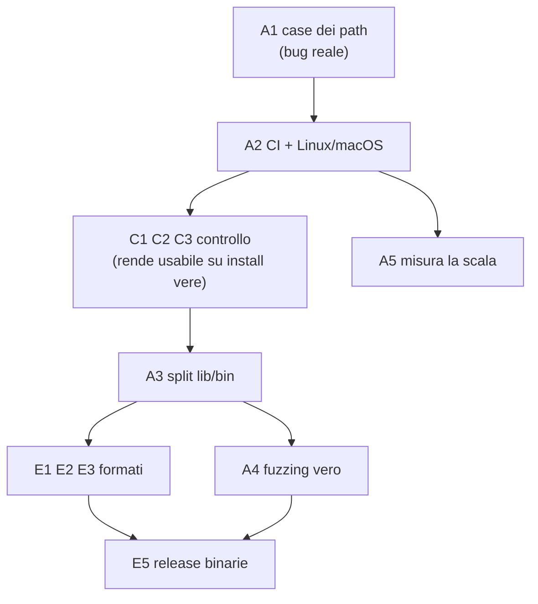

# ModConflict — Prossimi step: affidabilità, controllo, espandibilità

**Stato di partenza**: 175 test verdi (164 senza feature), clippy pulito, 9 giochi,
4 layer (testo, container binari, record, hash). Piano affidabilità/compatibilità
chiuso tranne il corpus reale.

---

## 0. Il bug trovato scrivendo questo piano

**Le sovrapposizioni di file sono confrontate case-sensitive. È un falso
negativo nella funzione principale.**

- `scan::normalize` ([scan.rs:279](../../src/scan.rs)) sistema i separatori ma
  non il case; `conflict::file_overlaps` ([conflict.rs:69](../../src/conflict.rs))
  usa il path esatto come chiave di una `HashMap`.
- Windows, le lookup dentro i BSA Bethesda e la risoluzione asset della maggior
  parte dei giochi sono **case-insensitive**. `Textures/Iron.dds` e
  `textures/iron.dds` sono lo stesso file per il gioco e due file diversi per
  ModConflict. Il conflitto esiste, il report tace.
- **Il codice è già incoerente**: estensioni ([scan.rs:124](../../src/scan.rs),
  [profile.rs:174](../../src/profile.rs)), nomi plugin
  ([manager.rs:57](../../src/manager.rs)) e master
  ([records.rs:154](../../src/records.rs)) sono confrontati case-insensitive.
  Solo i path — il cuore della feature — no.
- Tocca anche `hash.rs` (`zip.by_name(path)` è esatto) e la regola di redundancy.

**Non si risolve abbassando tutto a minuscolo**: ext4 su Linux *è*
case-sensitive, quindi lì due path con case diverso sono davvero due file. Serve
una decisione: per profilo (`case_sensitive_paths`, default `false` perché i
giochi girano prevalentemente su Windows) oppure per piattaforma. Preferisco per
profilo: è una proprietà del gioco, non della macchina che scansiona.

Piccolo come diff, primo come priorità.

---

## 1. Affidabilità

### A1 — Case dei path (il bug sopra)
Chiave di overlap normalizzata secondo il profilo, `path` originale conservato
per il report. Test: due mod con case diverso confliggono su un profilo
case-insensitive e non su uno case-sensitive.
**Complessità: bassa.**

### A2 — CI, e la piattaforma mai provata
Non esiste `.github/`. I 175 test girano solo quando qualcuno se lo ricorda. Ma
il buco vero è un altro: **il tool non è mai stato compilato né eseguito su Linux
o macOS.** Normalizzazione `\\`, strip del BOM, `mo2_root`, il confronto dei
path: tutto scritto e verificato solo su Windows.

Matrice GitHub Actions — `windows` × `ubuntu` × `macos`, ognuna con build default
e `--no-default-features`, più `clippy -D warnings` e `fmt --check`. Trasforma
"funziona qui" in "funziona".

Va **subito dopo A1**, perché correggere il case è esattamente il tipo di
modifica che si rompe sull'altra piattaforma.
**Complessità: bassa** (meccanica).

### A3 — Split in `lib` + `bin`
Oggi è un crate solo-binario. Non è cosmetica:
- **`cargo-fuzz` richiede un target `lib`**. Il buco "niente fuzzing vero"
  dichiarato nel README resta aperto finché non si fa questo.
- Sblocca i test di integrazione veri in `tests/` invece dei moduli `#[cfg(test)]`.
- Permette ad altri tool di incorporare il motore.

`src/lib.rs` espone `analyze`, `model`, `report`; `main.rs` diventa solo CLI.
**Complessità: media** (molte `pub(crate)` da rivedere).

### A4 — Fuzzing vero (dopo A3)
Target su `value::load`, `container::read`, `limits::max_xml_depth`, il percorso
plugin. Richiede nightly; gira in CI su schedule, non a ogni PR. Il passo di
mutazione deterministico attuale resta — è complementare, non sostituito.
**Complessità: bassa** dopo A3.

### A5 — Misurare la scala prima di ottimizzarla
I due debiti `ponytail:` in [records.rs](../../src/records.rs) sono aperti e
**nessuno li ha misurati**: parse whole-plugin (tutti i record id in memoria) e
confronto O(n²) a coppie. Un benchmark che genera 300 plugin e 5.000 mod
sintetici e asserisce un tetto di tempo e memoria trasforma un sospetto in un
numero. Solo dopo: bucket per master, `rayon` sullo scan.
**Complessità: media.**

### A6 — Rendere il corpus più facile da eseguire
Resta il buco più grande e serve una persona con mod veri. Abbassare la soglia:
modalità `--corpus-report` che scrive un riassunto incollabile in una issue
senza rivelare l'elenco dei mod dell'utente.
**Complessità: bassa.**

---

## 2. Controllo

Il tema è uno solo: **l'utente non può dire al tool "lo so, smettila".**

### C1 — Regole di ignore
Chi ha 30 patch di compatibilità volute vede 30 warning per sempre e smette di
leggere: esattamente il fallimento che l'hashing è stato costruito per evitare,
che rientra da un'altra porta.

`modconflict.toml` nella cartella mod (o `--config`): ignore per glob di path,
per coppia di mod, per tipo di conflitto. **Ogni soppressione va contata nel
report** ("4 findings suppressed by config") — il tool non deve mai mentire per
omissione, che è la regola già applicata a `unverified_requirements`.
**Complessità: media.**

### C2 — `--fail-on <severity>`
L'exit code è cablato su "qualsiasi cosa sopra Info". Chi usa il tool in CI vuole
`--fail-on critical`; chi è prudente vuole `--fail-on warning`.
**Complessità: bassa.**

### C3 — Baseline
`--baseline baseline.json`: accetta lo stato di oggi, riporta solo il nuovo. È
il modo in cui una persona con 300 mod installati **inizia** a usare il tool,
invece di rimbalzare su un muro di findings preesistenti.
**Complessità: media.**

### C4 — Filtri anche fuori dalla TUI
La TUI ha `/` e il ciclo di severità; la CLI non ha niente. `--severity`,
`--mod`, `--kind`.
**Complessità: bassa.**

### C5 — Config anche per i flag
Un'installazione grande non deve ridigitare `--manager mo2 --profiles ...
--no-records` a ogni run. Stesso file di C1.
**Complessità: bassa** se fatta insieme a C1.

---

## 3. Espandibilità

### E1 — Altri linguaggi di metadati
`Format` ha tre varianti. Ogni aggiunta è un arm dell'enum più una `from_*` in
[value.rs](../../src/value.rs) — la forma è già dimostrata tre volte.

- **INI** — sblocca 7 Days to Die, diversi titoli Unity, parte dei Paradox.
- **YAML** — altri ancora.
- **JSONC / JSON5** — *questo non è espansione, è una correzione*: i manifest
  Minecraft reali contengono commenti e virgole finali, e `serde_json` stretto
  li rifiuta. Oggi è un falso negativo su mod veri, e si manifesta come
  copertura metadati bassa.

**Complessità: bassa ciascuno.**

### E2 — Altri container binari
Una riga nella tabella `FORMATS` di [container.rs](../../src/container.rs):
sniff + read, crate esistente ogni volta che c'è.
`.tmod` (Terraria), Unity asset bundle, `.rpa` (Ren'Py), `.wad`.
**Complessità: bassa ciascuno**, se il crate esiste.

### E3 — Archivi annidati
Limite dichiarato: un `.zip` che contiene un `.bsa` non viene espanso. È comune
nelle distribuzioni di mod. Serve un tetto di profondità (aggancio naturale a
[limits.rs](../../src/limits.rs)).
**Complessità: media.**

### E4 — Lua per i prototype Factorio
Il limite storico. Valore reale — la collisione di nomi prototype *è* il
conflitto Factorio vero — ma è il pezzo più grosso di tutta la lista: parsing di
`data.lua` con `mlua` o `full_moon`. Da nominare, non da fare adesso.
**Complessità: alta.**

### E5 — Binari precompilati
Oggi serve `cargo`. Release su tag via CI per Windows/Linux/macOS.
**Vincolo di licenza da rispettare**: il build di default è GPL-3.0 per via di
`esplugin`, quindi la release deve accludere la licenza e offrire il sorgente.
Vale la pena pubblicare **due** binari etichettati: quello completo (GPL-3.0) e
quello `--no-default-features` (permissivo, senza confronto record).
**Complessità: media**, quasi tutta in CI e nel testo della release.

### E6 — Contratto JSON versionato
Con E5 e A3 il report JSON diventa un contratto pubblico. `"schema_version": 1`,
così i tool a valle possono dipenderci.
**Complessità: bassa.**

---

## 4. Ordine consigliato

**Perché quest'ordine:**
1. Prima il bug di correttezza — tutto il resto costruisce sopra.
2. CI subito dopo, perché la correzione del case è proprio ciò che si rompe
   sull'altra piattaforma, e quella piattaforma non è mai stata provata.
3. Il controllo prima dell'espansione: **aggiungere giochi a un tool che
   sotto-riporta significa diffondere un bug.** E C1/C3 sono anche ciò che rende
   possibile a qualcuno usarlo su un'installazione vera — cioè ciò che sblocca
   il corpus (A6).
4. Espandibilità dopo, su fondamenta verificate.

---

## 5. Rischi

| Rischio | Probabilità | Mitigazione |
|---|---|---|
| A1 introduce falsi *positivi* su Linux | Media | Scelta per profilo, non globale; test su entrambi i comportamenti; CI su ubuntu la verifica davvero |
| CI rivela che il tool non compila su Linux | **Alta** | È l'obiettivo, non un imprevisto. Mettere in conto tempo di correzione, non solo di setup |
| Le regole di ignore diventano un modo per nascondere problemi veri | Media | Contare sempre le soppressioni nel report; mai un silenzio totale |
| Lo split lib/bin rompe la struttura dei test | Media | Farlo dopo il controllo, quando l'API pubblica è più chiara; un commit solo, niente altre modifiche insieme |
| Le release GPL/MIT vengono confuse | Media | Due artefatti con nomi espliciti, licenza acclusa in entrambi, README della release che lo dice in prima riga |
| E4 (Lua) si mangia il progetto | Alta se iniziato | Non iniziarlo finché il resto non è chiuso |

---

## 6. Debito documentale da chiudere lungo la strada

Il README elenca ancora tra i limiti noti: *"Version comparison is semver.
Requirements in another dialect — Forge's Maven ranges — are treated as
satisfied"*. **Non è più vero** dalla Fase 13. Da correggere.

---

## 7. Fuori scope, confermato

Invariati dal piano precedente: deduplicazione su disco, hardlink,
ripacchettamento, ordinamento automatico del load order (è LOOT), GUI.
Il tool **legge**.
