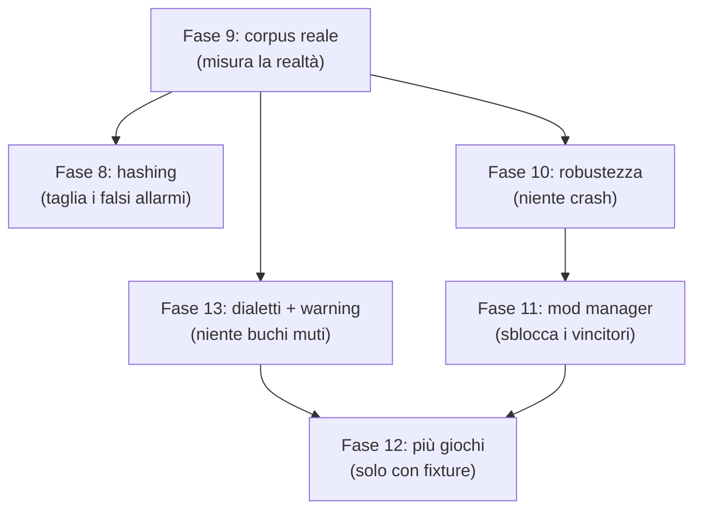

# ModConflict — Piano: affidabilità e compatibilità

**Obiettivo**: rendere il tool *credibile* (pochi falsi allarmi, nessun crash su
input reale) e *largo* (più giochi, con la garanzia che ognuno funzioni davvero).

**Stato di partenza**: v0.1.0, 93 test verdi, 5 profili, 3 layer (testo,
container binari, record). Fasi 0–7 completate.

---

## 0. Il buco più grande, detto subito

**Nessun mod reale è mai passato attraverso questo tool.** Ogni test usa fixture
sintetiche costruite da noi. Le librerie di parsing (`ba2`, `esplugin`, `zip`)
sono testate a monte, ma *la nostra integrazione* no: euristiche di path, lista
`BORING_PATHS`, fallback degli id, riconoscimento del gioco, tutto è tarato su
esempi inventati.

Questo condiziona l'ordine delle fasi. Misurare prima, ottimizzare dopo.

---

## 1. Fase 8 — Hashing del contenuto (precisione)

**Problema**: due mod che spediscono lo stesso identico file producono un
warning. È rumore: se i byte coincidono, chi vince è irrilevante.

**Cosa fare**
- Hash (BLAKE3, veloce e già in un crate) dei file coinvolti in un overlap,
  calcolato **solo** per i path in conflitto — non per l'intera cartella.
- `FileOverlap` guadagna `identical: bool`. Se identico: severità `Info` invece
  di `Warning`, con testo che dice esplicitamente "nessun effetto".
- Nuovo `Conflict::RedundantMod` quando *tutti* i file di un mod sono
  byte-identici a quelli di un altro: è una copia, va rimossa.
- Report: conteggio dei file sciolti, come nota informativa per i giochi dove
  impacchettare accelera il caricamento (Bethesda).

**Costo**: l'hash richiede di *leggere* i file, che finora non facevamo mai —
solo gli indici. Limitato ai path in conflitto resta contenuto. Da misurare, e
un `--no-hash` se serve.

**Non fare**: deduplicazione su disco, hardlink, riscrittura degli archivi. Il
tool legge e basta.

---

## 2. Fase 9 — Corpus di mod reali

La fase che rende vere tutte le altre.

**Cosa fare**
- Test di integrazione opt-in: `MODCONFLICT_CORPUS=<dir> cargo test --ignored`.
  Punta a cartelle mod reali sulla macchina di chi sviluppa, non nel repo
  (licenze).
- Asserzioni: nessun panic, nessun `unreadable`, gioco riconosciuto
  correttamente, tempo entro una soglia.
- Un corpus pubblico minimo nel repo: 3–4 mod con licenza permissiva per
  gioco, se si trovano. Altrimenti documentare come costruirselo.
- **Snapshot dei report**: output testuale e JSON congelati, così una modifica
  che cambia i risultati si vede nel diff invece che in produzione.

**Cosa aspettarsi**: che rompa delle cose. È lo scopo.

---

## 3. Fase 10 — Robustezza sull'input ostile

Il tool apre archivi binari scaricati da internet. Oggi non ha **nessun**
limite: un archivio con 10 milioni di voci fa esplodere la memoria, e un panic
in un parser porta giù tutta la scansione.

**Cosa fare**
- `cargo-fuzz` su tre superfici: `value::load` (JSON/TOML/XML), `container`
  (sniff + read), il percorso plugin. Ogni panic è un bug di affidabilità.
- Tetti espliciti: numero massimo di voci per archivio, dimensione massima di
  un file di metadati, profondità massima. Superarli è un warning, non un
  crash.
- Isolare i parser di terze parti: un panic dentro `ba2`/`unpak` deve costare
  un solo archivio, non l'intera scansione (`catch_unwind` al confine).
- Zip bomb: rapporto di compressione sospetto va segnalato, non espanso.

---

## 4. Fase 11 — Integrazione con i mod manager

**Sblocca la correttezza che ho volutamente rinunciato a indovinare.**

Oggi il profilo `creation-engine` non ha load order perché `plugins.txt` elenca
*nomi di plugin* mentre il nostro id è il *nome della cartella mod*. Il mod
manager conosce entrambi.

**Cosa fare**
- Leggere `modlist.txt` di MO2 (ordine + abilitati, `+`/`-` come prefisso) e il
  suo `plugins.txt`, così la mappatura plugin↔mod esiste davvero.
- Leggere il profilo Vortex se il formato è accessibile senza reverse
  engineering; altrimenti dichiarare che non è supportato.
- `--manager mo2|vortex|none`, con rilevamento automatico dalla struttura
  della cartella.
- Solo allora: vincitore degli overlap per i giochi Bethesda, e ordine dei
  plugin per dire *quale* dei due vince un record.

**Nota di scope**: leggere, mai scrivere. Non tocchiamo i profili del manager.

---

## 5. Fase 12 — Più giochi, con garanzia

Ogni profilo nuovo è un file TOML. Il rischio non è scriverlo, è che sia
*sbagliato in silenzio*.

**Prima l'infrastruttura**
- `profiles/fixtures/<nome>/` con un file di metadati d'esempio e un
  `expected.json` (id, versione, dipendenze attese).
- Un test generico che cicla su tutti i profili: se manca la fixture, il test
  fallisce. Un profilo senza prova non entra.

**Poi i profili**, in ordine di popolarità della scena modding:

| Gioco | Metadati | Note |
|-------|----------|------|
| Stardew Valley | `manifest.json` (SMAPI) | `UniqueID`, `Dependencies` |
| RimWorld | `About/About.xml` | `packageId`, `modDependencies` |
| Baldur's Gate 3 | `meta.lsx` dentro un `.pak` | serve leggere *dentro* un container |
| Bannerlord | `SubModule.xml` | `DependedModules` |
| Cities: Skylines / KSP | vari | verificare |
| tModLoader (Terraria) | `.tmod` | formato binario proprio |
| 7 Days to Die | `ModInfo.xml` | |
| Valheim / BepInEx | attributi DLL | metadati .NET, non testo |

**Servirà anche**
- Formato `ini` in `value.rs` (diversi giochi lo usano).
- **Metadati dentro un container**: BG3 mette `meta.lsx` dentro il `.pak`. Oggi
  i container danno solo la lista path, non i contenuti. Estensione naturale:
  il reader può anche estrarre un file per nome.
- Archivi annidati: un `.zip` che contiene un `.bsa` oggi non viene espanso.

---

## 6. Fase 13 — Dialetti di versione e warning visibili

**Due bugie per omissione nel codice attuale.**

1. `version_mismatch` tratta come *soddisfatto* qualsiasi requisito che semver
   non sa leggere. I range Maven di Forge (`[36,)`) e i `1.20.x` di Fabric
   ricadono qui. La scelta è giusta — un falso allarme è peggio di un buco — ma
   **il buco è invisibile**.
2. I warning (archivio illeggibile, plugin corrotto) vanno su stderr e
   **spariscono del tutto in `--json`**.

**Cosa fare**
- Parser per i range Maven e per i pattern `x`/`*`, dietro un campo
  `version_syntax` nel profilo (`semver` di default).
- Requisito non interpretabile: nuovo esito `Unverified`, contato nel report
  ("3 requisiti non verificabili"), non silenzioso.
- Campo `warnings` nell'envelope JSON.

---

## 7. Ordine e motivazione

**Il corpus va per primo** anche se non produce funzionalità: tara tutto il
resto. Tarare `BORING_PATHS` o l'hashing senza dati reali significa indovinare
due volte.

---

## 8. Rischi

| Rischio | Impatto | Mitigazione |
|---------|---------|-------------|
| Il corpus reale rivela molti falsi positivi | Alto | È l'obiettivo, non un imprevisto. Budget di tempo per la taratura, non solo per il test |
| L'hashing rallenta scansioni grandi | Medio | Solo i path in conflitto; misurare; `--no-hash` |
| Formati dei mod manager non documentati | Medio | MO2 è testo e leggibile. Vortex: se richiede reverse engineering, dichiararlo non supportato invece di indovinare |
| Profili scritti senza mod reali sottomano | Alto | Nessun profilo senza fixture. Il test generico lo impone |
| `catch_unwind` nasconde bug veri | Medio | Solo al confine con le librerie esterne, sempre con un warning visibile |
| Scope creep verso "mod manager" | Alto | Invariante dall'inizio: il tool **legge**. Mai scrivere nella cartella mod né nei profili del manager |

---

## 9. Cosa resta deliberatamente fuori

- **Deduplicazione su disco, hardlink, ripacchettamento.** L'hashing serve a
  ridurre i falsi allarmi, non a modificare l'installazione.
- **Ottimizzazione dei tempi di caricamento.** Il motore carica già solo il
  vincitore; il tool può segnalare (troppi file sciolti), non intervenire.
- **Ordinamento automatico del load order.** È LOOT. Non riscriviamolo.
- **GUI.** La TUI basta.

---

## 10. Fase 12 — fatta

**Infrastruttura prima, profili poi.** `profiles/fixtures/<nome>/` con file di
metadati d'esempio e `expected.json`; il test rifiuta un profilo senza fixture e
segnala una fixture senza profilo. `expected.json` porta `source_of_truth`, così
una fixture sbagliata si rintraccia invece di discuterla. Verificato al
contrario: nascondendo una fixture il test fallisce con il messaggio giusto.

**Quattro giochi nuovi**: Stardew Valley (SMAPI), RimWorld, Bannerlord,
Baldur's Gate 3.

**Tre lacune dello schema**, tutte generatrici latenti di falsi positivi:
- `version_prefix` — `MinimumVersion: "1.20.0"` letto alla lettera diventa
  `^1.20.0` per semver, che rifiuta ogni major successiva. Confermato dal vivo:
  SpaceCore 2.5.0 risulta pulito solo con il prefisso.
- `kind` ora vale anche per `prefixed-strings` come default di una voce nuda:
  la stessa sintassi è lista di dipendenze per Farming Simulator e
  `incompatibleWith` per RimWorld.
- `optional_field`, per i formati che scrivono `Optional="true"` invece di
  `mandatory=false`.

**Un falso positivo reale**, trovato da un run dal vivo: ogni mod Stardew
spedisce un `manifest.json`, quindi ogni coppia di mod "confliggeva". Corretto
alla radice — il file di metadati di un profilo è noioso per definizione ed è
escluso in automatico, così i profili futuri ereditano la correzione.

**BG3 e il limite del dichiarativo.** LSX richiederebbe predicati di path.
Invece: `metadata_reader = "bg3-pak"`, un lettore in codice che risponde nella
stessa forma. `larian-formats` fa il parsing; noi mettiamo solo il seam. Serviva
anche che un container a livello superiore contasse come mod, e che il
riconoscimento guardasse il nome del file sorgente e non solo il contenuto —
per BG3 il mod *è* il `.pak`.

**Prossimo**: Fase 9 (corpus reale). Ora ancora più necessaria: quattro profili
nuovi tarati su documentazione, zero mod veri.

---

## 11. Fase 9 — fatta (l'infrastruttura)

**Vincolo dichiarato**: i mod reali non possono stare nel repo — lavoro altrui,
licenze altrui, e pesanti. Quindi il corpus vive sulla macchina di chi lo lancia
e questa fase consegna ciò che rende la validazione *ripetibile*, non il corpus.

**Il segnale che mancava.** Un profilo sottilmente sbagliato non crasha: non
legge niente, ripiega sui nomi file e riporta allegramente una cartella pulita.
Ora ogni report dice quanto ha capito. Dimostrato dal vivo forzando il profilo
sbagliato: `no conflicts found` accompagnato da `0 of 4 mods (0%)`. Da solo,
quel "no conflicts found" era una bugia pericolosa.

`mods_with_metadata` è anche nel JSON, ed è l'asserzione forte del corpus.

**`analyze.rs`**: il pipeline era duplicato tra `main` e i test, e ora serve
anche al corpus. Un test che reimplementa il pipeline dimostra che funziona la
reimplementazione. Un solo punto, tre chiamanti.

**`corpus.rs`**: test `#[ignore]`d, `MODCONFLICT_CORPUS` più un `corpus.toml`
per cartella con gioco atteso, minimo di mod, copertura minima, budget di tempo
e plugin illeggibili tollerati. Ogni entry gira anche dopo un fallimento — serve
il quadro completo, non il primo inciampo. Le asserzioni riguardano la salute
del *tool*, mai la pulizia dei mod: una cartella vera ha conflitti, e un harness
che fallisse su quelli sarebbe inutile. Tre test non-ignored coprono l'harness
stesso, incluso il caso "profilo sbagliato deve fallire il check".

**`snapshot.rs`** + `tests/snapshots/`: testo e JSON congelati per cartelle note.
`UPDATE_SNAPSHOTS=1` per rigenerare. Ha già pagato: ha reso visibile
"1 conflicts", corretto subito.

**Resta da fare, e serve una persona con dei mod**: puntare `MODCONFLICT_CORPUS`
a cartelle vere e tarare. Copertura sotto il 100% su una cartella fidata è un
bug da scrivere.

---

## 12. Fase 10 — fatta

**Una vulnerabilità vera, trovata scrivendo il test e guardandolo crashare.**
Un XML annidato 50.000 livelli manda in stack overflow `roxmltree::Document::parse`
*prima* che il nostro codice giri. Uno stack overflow **aborta il processo**:
`catch_unwind` non lo intercetta. Quindi il controllo di profondità sta a monte
del parser, come scanner di byte e non come parser — sovrastima su `>` dentro un
attributo, e sovrastimare è la direzione sicura per una guardia il cui compito è
girare prima di qualcosa che altrimenti fa cadere il processo.

Il primo tentativo (cap dentro `from_xml`) non serviva a niente: il crash
avveniva prima. Utile ricordarlo — la difesa va messa dove sta il rischio, non
dove sta il nostro codice.

**Limiti** (`limits.rs`): 200k voci per zip, 500k per archivio binario, 8 MB per
file di metadati, rapporto 200:1 come soglia di decompression bomb, 100 livelli
di annidamento. Superarli è warning + troncamento, mai crash e mai successo
silenzioso.

**Panic boundary** attorno a `ba2`/`unpak`/`vpk`/`esplugin`: un panic costa un
archivio, non la scansione di duecento mod leggibili.

**Warning raccolti invece che stampati** — arrivano al report testuale *e* al
JSON (campo `warnings`). Era un pezzo della Fase 13, tirato avanti perché senza
non si può *testare* che un limite sia scattato.

**Fuzzing**: `cargo-fuzz` vuole nightly e un target `lib` che questo crate non
ha. Al suo posto un passo di mutazione deterministico (seed fisso, quindi
riproducibile) nella suite normale. Più debole di un fuzzer nel trovare casi
nuovi, più forte in una cosa: gira a ogni `cargo test`.

**Gli snapshot hanno pagato di nuovo**: hanno intercettato il cambio di
contratto JSON (campo `warnings` nuovo) invece di lasciarlo passare.

**Prossima**: Fase 8 (hashing) o 11 (mod manager). La 13 è per metà già fatta.

---

## 13. Fase 11 — fatta

**L'intuizione che ha ridotto il lavoro**: la mappatura plugin↔mod non va letta
da nessuna parte. La scansione sa già quale mod spedisce quale `.esp`
(`records.provides`). Al manager mancavano solo i *due ordinamenti*, e sono file
di testo.

**MO2**: `modlist.txt` (priorità), `loadorder.txt`/`plugins.txt` (ordine
plugin), `ModOrganizer.ini` (profilo attivo). Rilevamento automatico: `mods/` e
`profiles/` stanno fianco a fianco.

**Il dettaglio che decide tutto**: `modlist.txt` è scritto **priorità più alta
per prima**. L'ordine di caricamento è il file rovesciato. Sbagliarlo avrebbe
nominato vincitore il perdente di *ogni* sovrapposizione, con totale sicurezza.
Un test lo blocca.

**Risultato**: `[WARN] 2 mods ship textures/iron.dds (WeaponRebalance wins)` e
`[WARN] ... both edit 2 records (WeaponRebalance.esp wins)`. Con `--manager
none` gli stessi due conflitti restano, senza vincitore inventato.

**Vortex: dichiarato non supportato.** Tiene lo stato in un LevelDB, non in file
di testo; leggerlo significherebbe reverse-engineering di un formato interno non
documentato che cambia tra le release. Dirlo è più utile che indovinare male.

**Un panic vero nel codice nuovo**, trovato dal run dal vivo e non dai test:
`split_at(1)` su una riga che inizia col BOM UTF-8 spacca su un confine di
carattere — e PowerShell scrive il BOM di default, quindi è *lo* scenario
Windows. Corretto con `strip_prefix` e strip del BOM, più due regression test
(BOM e nomi mod non-ASCII). Nota: la Fase 10 aveva appena finito di blindare
l'input ostile, e la stessa classe di bug è rientrata dalla finestra con il
codice nuovo. I test sintetici non lo avevano preso perché li scrivevo in ASCII
puro.
